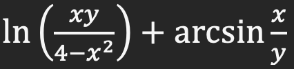

# Лабораторная работа 1 ПТПМ

**Ручная отладка программного обеспечения**

___

**Цель работы:** изучить процесс отладки программного обеспечения ручным методом.

1.

2.
- **Математическая модель:**

| Имя переменной       | Назначение переменной                       | Тип переменной |
|----------------------|---------------------------------------------|----------------|
| root                 | Основной объект окна Tkinter                | Tk()           |
| exp_pic              | Изображение для выражения                   | Image          |
| line_pic             | Изображение с линией                        | Image          |
| gh_image             | Изображение для кнопки ГитХаба              | Image          |
| w_gh_image           | Изображение для активной кнопки ГитХаба     | Image          |
| questions            | Изображение для кнопок "вопросы"            | Image          |
| w_questions          | Изображение для активных кнопок "вопросы"   | Image          |
| pattern              | Регулярное выражение для валидации ввода    | str            |
| xent                 | Поле ввода для значения x                   | Entry          |
| yent                 | Поле ввода для значения y                   | Entry          |
| title                | Текстовая метка для заголовка               | Label          |
| exp                  | Изображение с выражением                    | Label          |
| xlbl                 | Текстовая метка "x ="                       | Label          |
| x_questions_btn      | Кнопка "вопросы по x"                       | CircleButton   |
| ylbl                 | Текстовая метка "y ="                       | Label          |
| y_questions_btn      | Кнопка "вопросы по y"                       | CircleButton   |
| ans_lbl              | Текстовая метка для вывода ответа           | Label          |
| line_lbl             | Изображение с линией                        | Label          |
| calc_btn             | Кнопка "Вычислить"                          | Button         |
| gh_btn               | Кнопка для открытия профиля на ГитХабе      | CircleButton   |
| x_questions_btn_func | Функция для вопросов по x                   | function       |
| y_questions_btn_func | Функция для вопросов по y                   | function       |
| ok_btn_func          | Функция кнопки "ОК" в окне вопросов         | function       |
| top                  | Второстепенное окно для вопросов по x/y     | Toplevel       |
| lbl                  | Текстовая метка с описанием вопросов по x/y | Label          |
| next_btn             | Кнопка "ОК" в окне вопросов                 | Button         |
| BTN_CONFIG           | Параметры для кнопок                        | dict           |
| CIRCLE_BTN_CONFIG    | Параметры для круглых кнопок                | dict           |
| TEXT_CONFIG          | Параметры для текстов                       | dict           |
| EXP_CONFIG           | Параметры для картинки с выражением         | dict           |
| LINE_CONFIG          | Параметры для картинки с линией             | dict           |

- **Спецификация программы:**

Эта программа представляет собой графический интерфейс на основе библиотеки tkinter для вычисления значения математического выражения. Пользователь вводит значения переменных x и y, после чего программа производит расчет по определенной формуле.

Модули и библиотеки:
• tkinter: используется для создания графического интерфейса.
• tkmacosx: используется для создания круглых кнопок на macOS.
• other.params: импортирует конфигурационные параметры для кнопок и изображений.
• other.questions.x_questions, other.questions.y_questions: импортируют функции для обработки вопросов по переменным x и y.
• re: используется для работы с регулярными выражениями.
• math: используется для выполнения математических операций.
• webbrowser: используется для открытия профиля GitHub в веб-браузере.

Функции:
• menu_func(root, exp_pic, line_pic, gh_image, w_gh_image, questions, w_questions): главная функция, создающая графический интерфейс и обработчики событий. Включает в себя следующие элементы: поле для ввода переменной x, кнопка с вопросами по переменной x, поле для ввода переменной y, кнопка с вопросами по переменной y, метка с ответом на выражение, кнопка "Вычислить", изображение с математическим выражением, изображение с линией, кнопка-ссылка на профиль GitHub.
• calc_btn_func(event): функция, вызываемая при нажатии кнопки "Вычислить". Выполняет проверку ввода, вычисляет значение выражения и выводит результат.
• gh_btn_func(): функция, вызываемая при нажатии кнопки-ссылки на профиль GitHub. Открывает профиль в веб-браузере.

Используемые изображения:
• exp_pic: изображение с математическим выражением.
• line_pic: изображение с линией.
• gh_image: изображение для кнопки-ссылки на профиль GitHub.
• w_gh_image: альтернативное изображение для активного состояния кнопки-ссылки.
• questions: изображение для кнопок с вопросами по переменным.
• w_questions: альтернативное изображение для активного состояния кнопок с вопросами.

- **Тестовые наборы:**

| Тестовый набор значений  | Ожидаемый результат  | Фактический результат  | Ошибка обнаружена/не обнаружена  |
|--------------------------|----------------------|------------------------|----------------------------------|
| 000 | 000 | 000 | 000|
| 000 | 000 | 000 | 000|
| 000 | 000 | 000 | 000|
| 000 | 000 | 000 | 000|
| 000 | 000 | 000 | 000|
| 000 | 000 | 000 | 000|
| 000 | 000 | 000 | 000|
| 000 | 000 | 000 | 000|
| 000 | 000 | 000 | 000|
| 000 | 000 | 000 | 000|

3.
| Ошибка  | Пояснение | Исправление |
|---------|-----------|-------------|
|000|000|000|

**Контрольные вопросы:**

1. В чем заключается ручная отладка ПО?
   - Ручная отладка ПО представляет собой процесс выявления и исправления ошибок в программном коде вручную, с использованием инструментов отладки.

2. На каком этапе проводится ручная отладка?
   - Ручная отладка проводится на этапе разработки программного продукта после написания кода для выявления и устранения ошибок.

**Вывод:**

000